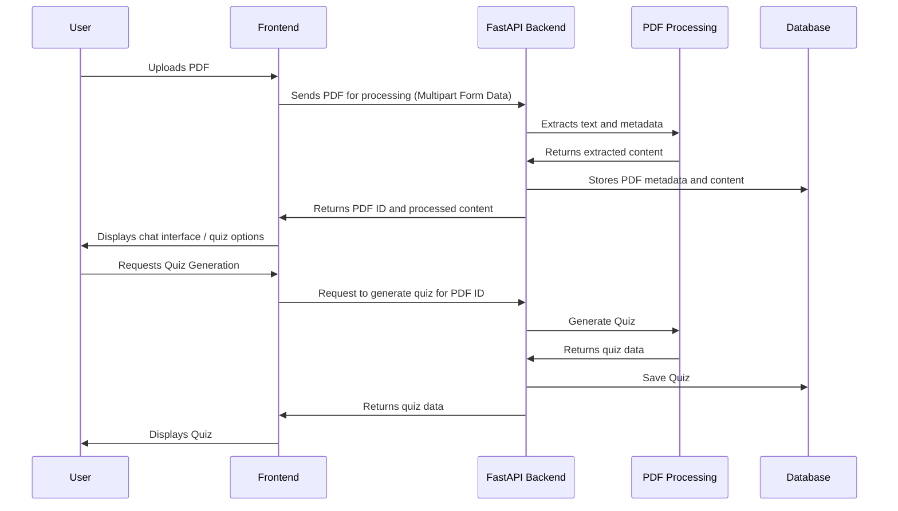

# Infobot - React + Vite Application

This project is a React-based web application built with Vite, designed to interact with a FastAPI backend for PDF processing and quiz generation. Users can upload PDFs, generate quizzes from them, and engage in conversations with the PDF content using AI.

## Features

-   **PDF Upload and Processing:** Users can upload PDF documents for analysis.
-   **Quiz Generation:** The application can automatically generate quizzes based on the content of the uploaded PDF.
-   **Chat Interface:** Users can interact with the PDF content through a conversational chatbot.
-   **User Authentication:** Secure user registration and login functionality.

## Technologies Used

-   **Frontend:** React, Vite, Tailwind CSS
-   **Backend:** FastAPI (Python)
-   **PDF Processing:** pdfjs-dist, react-pdf
-   **HTTP Client:** Axios
-   **Routing:** React Router

## Folder Structure
```
nahwngle-infobot/
├── README.md
├── eslint.config.js
├── index.html
├── package.json
├── postcss.config.js
├── tailwind.config.js
├── vite.config.js
├── public/
└── src/
├── App.css
├── App.jsx
├── index.css
├── main.jsx
├── setupTests.js
├── assets/
├── components/
│   └── ProtectedRoute.jsx
├── pages/
│   ├── Auth/
│   │   ├── Login.jsx
│   │   └── Register.jsx
│   ├── ChatbotScreen/
│   │   ├── BaseScreen.jsx
│   │   ├── OperateActions.jsx
│   │   ├── OperateScreen.jsx
│   │   ├── UploadFile.jsx
│   │   └── index.jsx
│   ├── QuizScreen/
│   │   ├── QuizDetail.jsx
│   │   ├── QuizScreen.jsx
│   │   └── QuizScreen.test.jsx
│   └── SideBar/
│       ├── PdfList.jsx
│       └── index.jsx
├── services/
│   ├── QuizStreamer.js
│   ├── authApi.js
│   ├── axiosClient.js
│   └── pdfApi.js
└── utils/
└── AuthContext.jsx
```

## Setup Instructions

1.  **Clone the repository:**

    ```bash
    git clone https://github.com/NahwngLe/Infobot.git
    cd infobot
    ```
2.  **Install dependencies:**

    ```bash
    npm install
    ```
3.  **Configure the environment:**

    *   Make sure you have a FastAPI backend running on `http://127.0.0.1:8000`.
4.  **Run the application:**

    ```bash
    npm run dev
    ```

## Backend Sequence Diagram (FastAPI)



## API Endpoints
The frontend interacts with the following FastAPI endpoints:

```
/auth/token: For user login, provides access token.
/auth/users/me: Get current user information, needs access token.
/auth/register: For user registration.
/pdf/upload: Uploads the PDF file.
/pdf/get-pdf/{pdfId}: Retrieves the PDF file by ID.
/pdf/get-all-pdf: Retrieves all PDFs.
/pdf/create-quiz/{id}?language_of_quiz={language}: Creates a quiz from a PDF ID.
/pdf/get-quiz/{id}: Retrieves a quiz by ID.
```

## Contributing
Contributions are welcome! Please fork the repository and submit a pull request with your changes.

##License
[License]
```
This `README.md` provides a comprehensive overview of the project, including its features, technologies, setup instructions, and a sequence diagram illustrating the interaction with the FastAPI backend.
```
