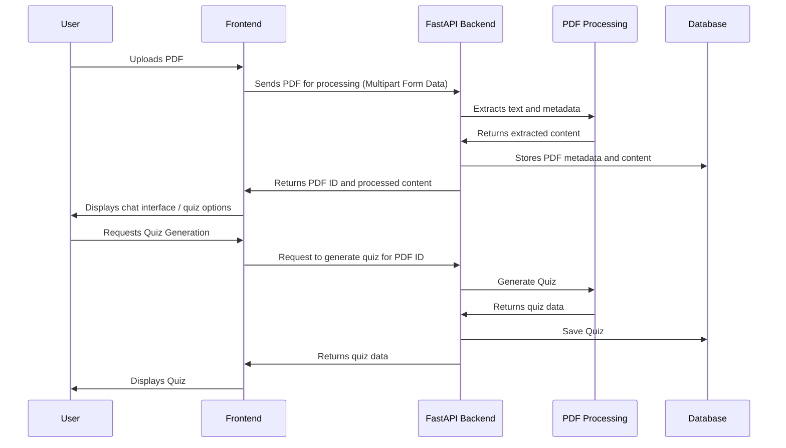

# 🤖 Infobot


[](https://reactjs.org/)
[](https://fastapi.tiangolo.com/)


> A modern AI-powered platform that allows users to upload PDFs, automatically generate quizzes from content, and chat with documents interactively. Built with **React + Vite** on the frontend and **FastAPI** on the backend.

---

## ✨ Features

- 📄 **PDF Upload & Processing:** Upload and extract text with OCR support.
- 🧠 **Quiz Generation:** Automatically generate quizzes from the PDF content.
- 💬 **AI Chat Interface:** Talk to your PDFs using conversational AI.
- 🔐 **Authentication System:** Secure login and registration.

---

## 🛠️ Technologies Used

### 📦 Frontend
- **React** + **Vite** ⚡
- **Tailwind CSS**
- **React Router**, **Axios**
- **PDF Libraries:** `pdfjs-dist`, `react-pdf`

### 🔧 Backend
- [**FastAPI** (Python)](https://github.com/NahwngLe/Infobot_backend.git)
- MongoDB, Pinecone, MongoDB (for processing)
- OpenAI / Gemini API for LLM-based quiz generation

---

## Folder Structure
```
nahwngle-infobot/
├── README.md
├── eslint.config.js
├── index.html
├── package.json
├── postcss.config.js
├── tailwind.config.js
├── vite.config.js
├── public/
└── src/
├── App.css
├── App.jsx
├── index.css
├── main.jsx
├── setupTests.js
├── assets/
├── components/
│   └── ProtectedRoute.jsx
├── pages/
│   ├── Auth/
│   │   ├── Login.jsx
│   │   └── Register.jsx
│   ├── ChatbotScreen/
│   │   ├── BaseScreen.jsx
│   │   ├── OperateActions.jsx
│   │   ├── OperateScreen.jsx
│   │   ├── UploadFile.jsx
│   │   └── index.jsx
│   ├── QuizScreen/
│   │   ├── QuizDetail.jsx
│   │   ├── QuizScreen.jsx
│   │   └── QuizScreen.test.jsx
│   └── SideBar/
│       ├── PdfList.jsx
│       └── index.jsx
├── services/
│   ├── QuizStreamer.js
│   ├── authApi.js
│   ├── axiosClient.js
│   └── pdfApi.js
└── utils/
└── AuthContext.jsx
```

## Setup Instructions

1.  **Clone the repository:**

    ```bash
    git clone https://github.com/NahwngLe/Infobot.git
    cd infobot
    ```
2.  **Install dependencies:**

    ```bash
    npm install
    ```
3.  **Configure the environment:**

    *   Make sure you have a FastAPI backend running on `http://127.0.0.1:8000`.
4.  **Run the application:**

    ```bash
    npm run dev
    ```

## Backend Sequence Diagram (FastAPI)



## API Endpoints

| Method | Endpoint                                    | Description                           |
| ------ | ------------------------------------------- | ------------------------------------- |
| `POST` | `/auth/token`                               | Login and receive token               |
| `GET`  | `/auth/users/me`                            | Get current user info (auth required) |
| `POST` | `/auth/register`                            | Register new user                     |
| `POST` | `/pdf/upload`                               | Upload a PDF                          |
| `GET`  | `/pdf/get-pdf/{pdfId}`                      | Get PDF by ID                         |
| `GET`  | `/pdf/get-all-pdf`                          | Get all user PDFs                     |
| `POST` | `/pdf/create-quiz/{id}?language_of_quiz=vi` | Create quiz (with language option)    |
| `GET`  | `/pdf/get-quiz/{id}`                        | Retrieve quiz                         |


## Contributing
Contributions are welcome!
Please fork this repo and submit a pull request.
Make sure to follow conventional commit messages.

## License
MIT © 2025 — [NahwngLe](https://github.com/NahwngLe)


